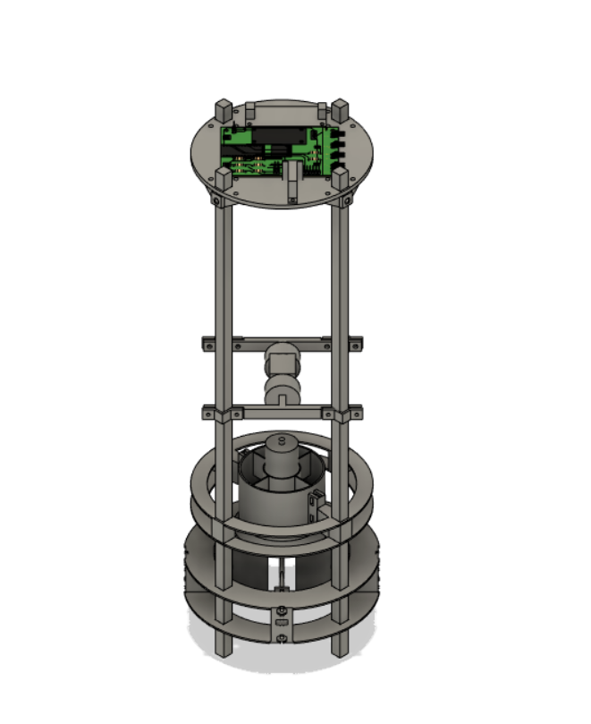

3D objects readme

 
 
# UAV
This is the entire cad model

# EDF Mount
This part mounts the electric ducted fan to the carbon fiber frame. I designed this part to be as light as possible which is why there are only 2 thin strips of material connecting each of the frame attachment points. THe mount does not need to be rigid in the vertical axis, and just needs to transfer the lift generated by the electric ducted fan to the carbon fiber frame, while ensuring it is rigid horizontally. From my testing, I found that it was unnecessary to have all 4 frame attachment points be fixed to the electric ducted fan, so instead, I only attached the electric ducted fan to 2 of the frame mounting points. Because this part was so optimized, it was a pain to print because it required lots of supports which alone weighed more than the part and were very difficult to remove from the print.

# ESC Mount
This part mounts the 80A ESC to the bottom of the foam core electronics disk. This part is screwed into the foam board with m2 screws and the foam core is reinforced with thin superglue. This method is totally experimental, but has worked for me so far. 

# Electronics Disk Mount
 This part is used to affix the foam core disk for the electronics to the carbon fiber mount. The round holes are designed to have threaded inserts mounted in them to allow the foam disk to be screwed in, and to allow the mounts to be screwed to the carbon fiber frame. This file contains all 4 mounts arranged radially and ready to be mounted, as well as a single one which will be easier to 3d print, change, or look at.

# Gimbal Mount
This is a two degree of freedom gimbal to allow for the uav to be stationary mounted and tested. It uses threaded inserts and m3 screws to clamp itself to the frame.

# Servo Mount
Mounts the servos and thrust vanes to the carbon fiber frame. This part is also extremely optimized to keep the weight down as much as possible.

#Thrust Vane
Thrust vane used to control the UAV.

#UAV PCB
All the necessary data for the PCB used on my UAV is here. Inside the UAv PEB folder is the schematic and board as well as a zip containing all the pertinent information for the PCB to be manufactured.

# Receiver Mount
Mounts the RC receiver to the foam core.

